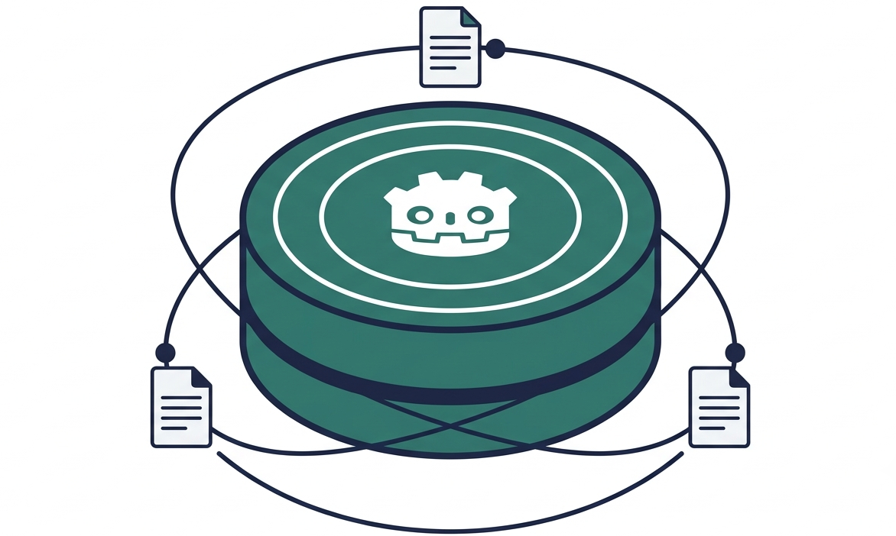

# Godot Documentation MCP Server



A local MCP server that gives coding agents accurate Godot knowledge based on the official Godot documentation. It offers two kinds
of tools: exact structured lookups over the class reference, and semantic search over
the full documentation. For now everything is built from the Godot 4.7
docs, and it all ships as a single SQLite file.
(`store/godot.sqlite`).

## Install

You don't need to clone the repo. `uvx` builds and runs the server from the
repository.

Claude Code:

```bash
claude mcp add godot-docs -- uvx --from git+https://github.com/NagoDaniel/godot_mcp godot-docs-mcp
```

Claude Desktop, Cursor, or VS Code, in the MCP config:

```json
{
  "mcpServers": {
    "godot-docs": {
      "command": "uvx",
      "args": ["--from", "git+https://github.com/NagoDaniel/godot_mcp", "godot-docs-mcp"]
    }
  }
}
```
On Copilot, you can also paste in ```uvx --from git+https://github.com/NagoDaniel/godot_mcp godot-docs-mcp``` after selecting the stdio option.
On the first run the server downloads what the necessary models and caches it in your home
directory.

Thus you might need to wait a minute before the semantic search is available.

Downloads: the prebuilt index (about 160 MB, verified against a checksum from the
GitHub release), the `bge-base` query embedder (about 210 MB), and the reranker
(about 80 MB). The server only waits on the index before it accepts connections --
the structured lookup tools work as soon as that's ready, and the embedder/reranker
finish loading in the background, so a semantic search issued in the first second or
two may pause briefly until they're done. If your MCP client's connection attempt
times out before the index finishes downloading, retrying works: the partial
download doesn't carry over, but everything else already fetched does, so each
attempt gets faster. If you'd rather skip the reranker for a smaller download and
slightly lower ranking quality, set `GODOT_MCP_RERANK=0` (see `eval/`).


## Tools

Structured lookups (exact, no model): `lookup_class`, `lookup_method`,
`lookup_property`, `lookup_signal`, `lookup_enum`, `lookup_constant`,
`show_inheritance`, `search_symbols`.

Semantic search: `search_docs`, `find_examples`, `related_docs`, `read_page`.

`search_docs` and `find_examples` accept an optional `lang` of `gdscript` or `csharp`,
which keeps only that language's code blocks (the Godot docs ship every snippet in
both). `read_page` pulls up the full page behind a hit's `url` when a passage looks
relevant but is too short to be useful on its own: tutorials come back in full, while
class-reference urls return the class overview and point you at the `lookup_*` tools.

Search hits stay lean, carrying just `text`, `title`, `url`, and `score`, and every
result includes a `docs.godotengine.org/...#anchor` citation.

## Running from source

```bash
uv sync                       # runtime deps only
uv run godot-docs-mcp         # start the server over stdio
```

For a local MCP registration during development, point the command at the checkout:
`"command": "uv", "args": ["run", "godot-docs-mcp"], "cwd": "<repo>"`.


## Layout

```
src/godot_mcp/       installable package (runtime)
  mcp_server.py        MCP tool definitions (entry point: godot-docs-mcp)
  lookups.py           structured query logic
  retrieval.py         semantic search (fastembed query + sqlite-vec KNN)
  data.py              resolve/download the index db
ingest/              offline pipeline (dev only; uv sync --extra ingest)
  clean.py             shared HTML cleanup + sphinx-tabs handling
  parse_classes.py     Pipeline A: class reference -> structured records
  parse_guides.py      Pipeline B: prose guides -> Markdown
  inventory.py         objects.inv -> typed symbol index
  load_db.py           class records -> sqlite
  chunk.py             header-aware chunking of both sources
  embed_index.py       chunks -> BGE embeddings -> sqlite-vec + FTS5
  build_all.py         run the whole pipeline in order
scripts/smoke.py     launch the server over stdio and exercise every tool
store/               build outputs (gitignored; godot.sqlite is the product)
```

## Building the index

You need the HTML docs in `godot-docs-html-stable/` and the ingest extra:

```bash
uv sync --extra ingest
uv run python ingest/build_all.py     # parse, index, chunk, embed (a few minutes on CPU)
uv run python scripts/smoke.py        # exercise every tool end-to-end; exit 0 means pass
```

`build_all.py` writes `store/godot.sqlite` (around 160 MB once the `bge-base` vectors
are in). That file is what gets attached to a release for `uvx` users.

## Design notes

The class reference and the prose guides go through two different parsers. The class
reference is already semantically structured in the HTML (`<p class="classref-*"
id=...>`), so it becomes structured records that both power the `lookup_*` tools and
feed clean per-member chunks into search. The guides are chunked header-aware.
`objects.inv` adds 29,586 typed symbols on top of that.

A few smaller decisions worth knowing:

- The `sphinx-tabs` GDScript/C# pairs are collapsed into labeled fenced code blocks so
  the same snippet isn't indexed twice.
- Embeddings use `BAAI/bge-base-en-v1.5` (768-d) through fastembed's ONNX runtime,
  which is torch-free, so the shipped package can embed a query cheaply. BGE-M3 was the
  original pick but isn't available in fastembed, and since the docs are English-only a
  strong English BGE model fits better anyway. The cross-encoder reranker does the
  precision-lifting at query time, so `bge-base` matches the larger `bge-large` model's
  reranked quality at a sixth of the download (see `eval/`). The embeddings are
  model-locked, so changing the model means a full re-index.
- The vectors live in `sqlite-vec` inside `godot.sqlite`, with an FTS5 table alongside
  for a future BM25 hybrid. There's no separate server process.


## License and attribution

The code is under the [MIT license](LICENSE). The prebuilt index
(`store/godot.sqlite`) contains structured records and text chunks derived from the
[Godot documentation](https://docs.godotengine.org/), which the Godot Engine community
licenses under [CC BY 3.0](https://creativecommons.org/licenses/by/3.0/). If you
redistribute the index, keep that attribution.
